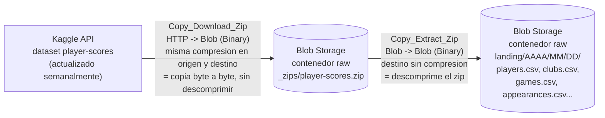

# Arquitectura de ingesta — Proyecto p2-futbol

Este documento describe la primera fase del pipeline de datos: la descarga automática y semanal del dataset [Football Data from Transfermarkt](https://www.kaggle.com/datasets/davidcariboo/player-scores) de Kaggle hacia una zona *raw* en Azure Blob Storage, orquestada con Azure Data Factory (ADF).

> **Estado**: esta fase cubre Kaggle → Azure Blob Storage. La siguiente fase (Blob → Snowflake, vía Storage Integration + Snowpipe con auto-ingest sobre Event Grid) se documentará en un README aparte cuando esté construida.

## 1. Flujo del dato

Los tres pasos, en palabras:

1. **Descarga** — ADF llama al endpoint de la API de Kaggle (`GET /api/v1/datasets/download/davidcariboo/player-scores`) y copia la respuesta, tal cual (comprimida), al contenedor `raw` de Blob Storage. No se descomprime en este paso porque una fuente HTTP normal no soporta lectura aleatoria (*seek*), y el formato ZIP la necesita para leer su índice de archivos.
2. **Almacenamiento intermedio** — el `.zip` queda aparcado en `raw/_zips/player-scores.zip`. Se conserva (no se borra) como copia exacta de lo que sirvió Kaggle esa semana: permite reprocesar la extracción sin volver a golpear la API si algo falla más adelante.
3. **Descompresión con partición por fecha** — una segunda actividad lee ese mismo zip, ahora desde Blob (que sí soporta lectura aleatoria), y extrae los CSV a `raw/landing/AAAA/MM/DD/`, usando la fecha de ejecución del pipeline. Cada semana genera una carpeta nueva, conservando el histórico completo de snapshots en vez de sobrescribir el anterior.

## 2. Recursos creados y relación entre ellos

| Recurso | Nombre | Tipo | Papel |
|---|---|---|---|
| Grupo de recursos | `rg-p2-futbol` | Resource Group | Agrupa el ciclo de vida de todo lo de esta fase |
| Data Factory | `adf-mfontenlos-p2-futbol` | Azure Data Factory (V2) | Contiene el pipeline, los datasets, los linked services y el trigger |
| Storage Account | `stp2futbolmfontenlos`  | Blob Storage (Standard, LRS) | Zona *raw*: contenedor `raw`, con `_zips/` y `landing/AAAA/MM/DD/` |
| Key Vault | `kv-p2futbol-mfontenlos` | Azure Key Vault (RBAC) | Guarda los secretos `kaggle-username` y `kaggle-key` |

**Identidad y permisos**: el Data Factory usa su *Managed Identity* (system-assigned) para autenticarse contra los otros dos recursos sin ninguna clave almacenada en ADF:

- **Key Vault Secrets User** sobre el Key Vault → puede leer secretos, no gestionarlos.
- **Storage Blob Data Contributor** sobre el Storage Account → puede leer y escribir blobs.

**Linked Services** (las conexiones que usa ADF):

| Linked Service | Tipo | Autenticación | Apunta a |
|---|---|---|---|
| `LS_KeyVault` | Azure Key Vault | Managed Identity | `kv-p2futbol-mfontenlos` |
| `LS_BlobStorage_Raw` | Azure Blob Storage | System Assigned Managed Identity | Storage Account, contenedor `raw` |
| `LS_HTTP_Kaggle` | HTTP | Basic — usuario en texto plano, contraseña leída desde `LS_KeyVault` (secreto `kaggle-key`) | `https://www.kaggle.com/api/v1/` |

**Datasets** (qué se lee/escribe en cada Linked Service):

| Dataset | Linked Service | Ruta | Compresión | Papel |
|---|---|---|---|---|
| `DS_Kaggle_Zip_Source` | `LS_HTTP_Kaggle` | `datasets/download/davidcariboo/player-scores` | ZipDeflate | Origen: el zip tal como lo sirve Kaggle |
| `DS_Blob_Zip_Staging` | `LS_BlobStorage_Raw` | `raw/_zips/player-scores.zip` | ZipDeflate | Intermedio: mismo zip aparcado en Blob |
| `DS_Blob_Raw_Extracted` | `LS_BlobStorage_Raw` | `raw/landing/{yyyy}/{mm}/{dd}/` (fecha dinámica) | Ninguna | Destino final: CSV descomprimidos |

**Pipeline y trigger**:

- **Pipeline** `PL_Ingest_Kaggle_Weekly`
  - Actividad `Copy_Download_Zip`: `DS_Kaggle_Zip_Source` → `DS_Blob_Zip_Staging`.
  - Actividad `Copy_Extract_Zip` (se ejecuta solo si la anterior tiene éxito): `DS_Blob_Zip_Staging` → `DS_Blob_Raw_Extracted`.
- **Trigger** `TR_Weekly_Kaggle_Sync`: tipo *Schedule*, recurrencia semanal, zona horaria Madrid. Publicado junto con el pipeline (`Publish all`) para quedar activo.

## 3. Decisiones de diseño a recordar para la defensa

- **Por qué dos Copy Activities y no una**: una fuente HTTP no soporta lectura aleatoria (*seek*), y el formato ZIP necesita saltar al final del archivo para leer su índice. Blob Storage sí la soporta, así que primero se aterriza el zip sin tocarlo y luego se descomprime desde ahí.
- **Por qué se conserva el `.zip` en `_zips/`**: es la prueba exacta de lo que Kaggle sirvió esa semana; permite reprocesar la extracción sin depender de la API de Kaggle si hace falta.
- **Por qué la carpeta de destino lleva la fecha**: conserva el histórico semana a semana (zona *raw* inmutable) en vez de sobrescribir; además evita colisiones si el pipeline se re-ejecuta.
- **Por qué todo usa Managed Identity y no claves/cuentas de almacenamiento**: ninguna credencial de Azure queda escrita en ningún sitio; los permisos se gestionan por rol (RBAC) y son revocables sin rotar secretos.
- **Por qué el usuario de Kaggle va en texto plano y la clave no**: el conector HTTP de ADF solo permite vincular a Key Vault el campo `password`; el nombre de usuario no se trata como secreto en este conector.
